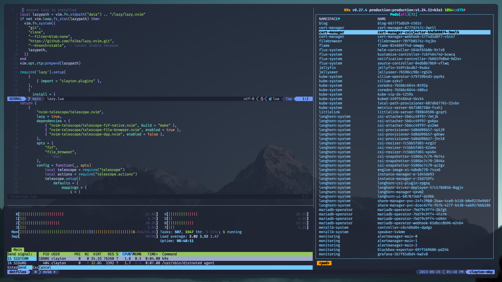
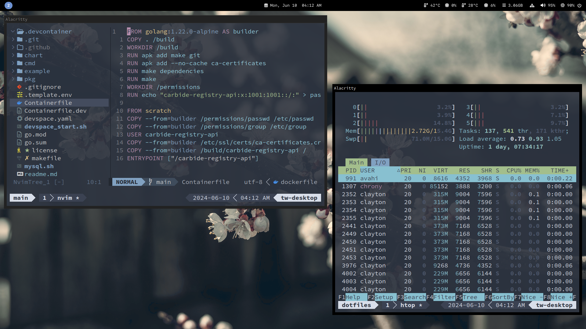

# Dotfiles

MacOS:

Linux:


Configuration files for my development environment. Feel free to grab anything you like.

## Installation

There are two options to install the contents of this repo. One is to symlink all files, allowing you to continue tracking them with git in your own fork of this repo. The other is to simply install (copy) the files without tracking them. 

>/bin contents will be placed in ~/.local/bin and /config contents will be placed in ~/.config

Make sure your $HOME and $XDG_CONFIG_HOME environment variables are set properly before running any of the following scripts.

```bash
$ ./install -h
Usage: ./install [options]

Options:
  -l, --link       Create symbolic links instead of copying files
  -b, --backup     Backup any non-symlink files to be overwritten
  -h, --help       Display this help message and exit
```

## Uninstall

To remove all previously installed/linked files:
```bash
./uninstall
```

## Configured Software

* Terminal Emulator(s): [Wezterm](https://wezfurlong.org/wezterm), [Alacritty](https://alacritty.org)
* Shell(s): [fish](https://fishshell.com), [bash](https://www.gnu.org/software/bash)
* Multiplexer: [tmux](https://github.com/tmux/tmux/wiki)
* Editor: [Neovim](https://neovim.io)
    * Plugin Manager: [lazy.nvim](https://github.com/folke/lazy.nvim)
* Keyboard Manager: [Kmonad](https://github.com/kmonad/kmonad)
* Kubernetes Management: [K9s](https://k9scli.io)
* Mac Specific:
    * Package Manager: [Homebrew](https://brew.sh)
    * Window Manager: [Yabai](https://github.com/koekeishiya/yabai)
    * General Scripting: [Hammerspoon](https://www.hammerspoon.org/)
* Linux Specific:
    * Window Manager/Compositor(s): [Sway](https://swaywm.org), [Hyprland](https://hyprland.org) 
    * Widgets: [Waybar](https://github.com/alexays/waybar), [Wlogout](https://github.com/ArtsyMacaw/wlogout)
    * Notifications: [SwayNC](https://github.com/ErikReider/SwayNotificationCenter)
    * Launcher: [Wofi](https://hg.sr.ht/~scoopta/wofi)
