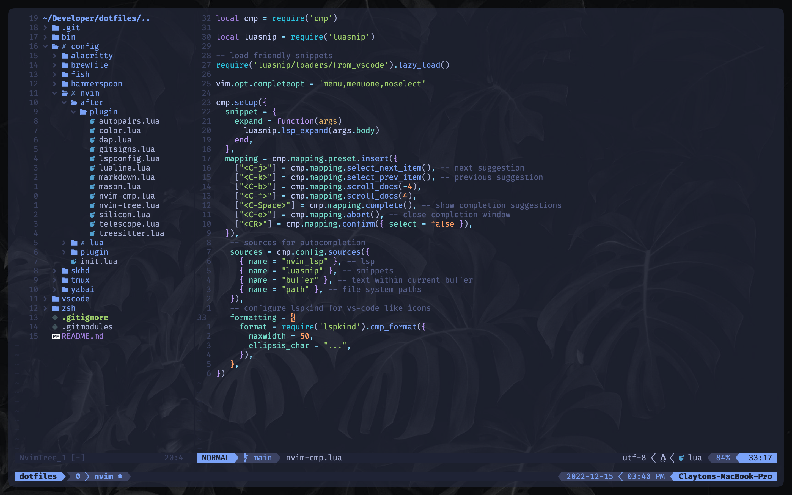

# dotfiles

Configuration files for my development environment. Feel free to grab anything you like.

# Software

* Terminal: [Alacritty](https://alacritty.org)
* Shell: [fish](https://fishshell.com)
* Multiplexer: [tmux](https://github.com/tmux/tmux/wiki)
* Editor: [Neovim](https://neovim.io)
* Git: [lazygit](https://github.com/jesseduffield/lazygit)
* Package Manager: [Homebrew](https://brew.sh)
